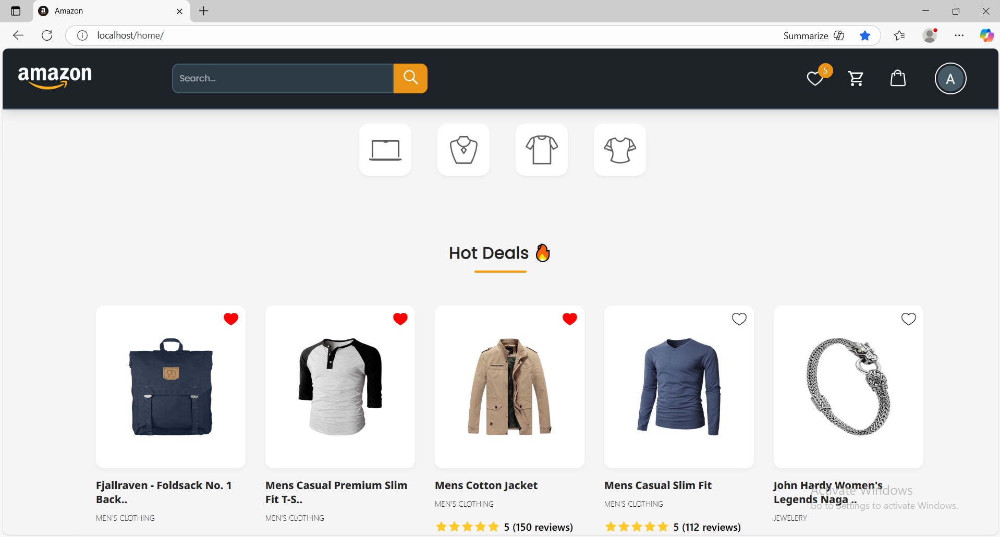
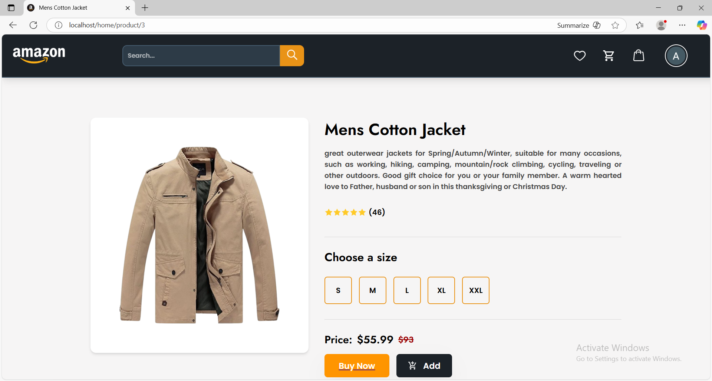
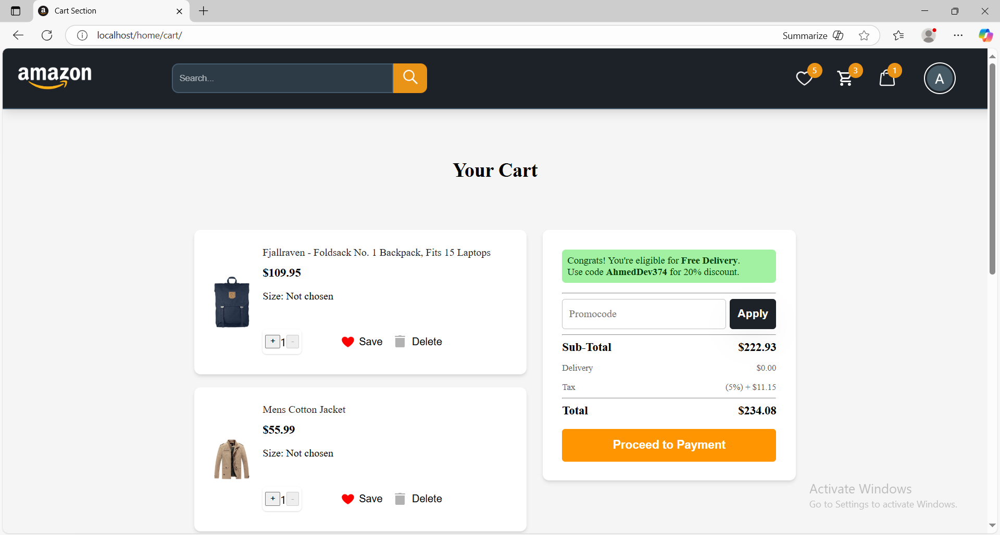
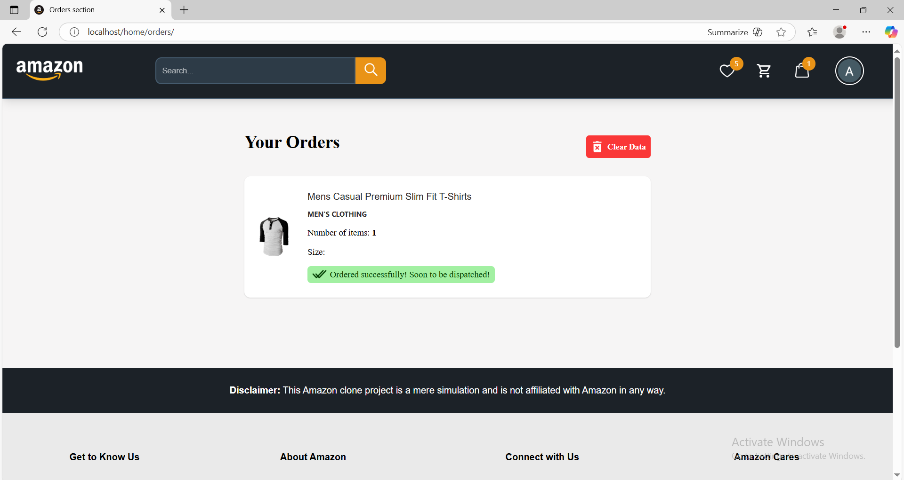
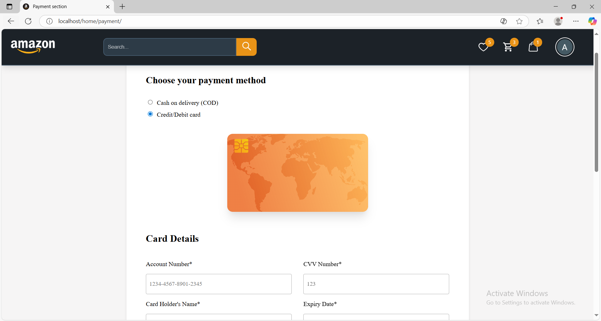
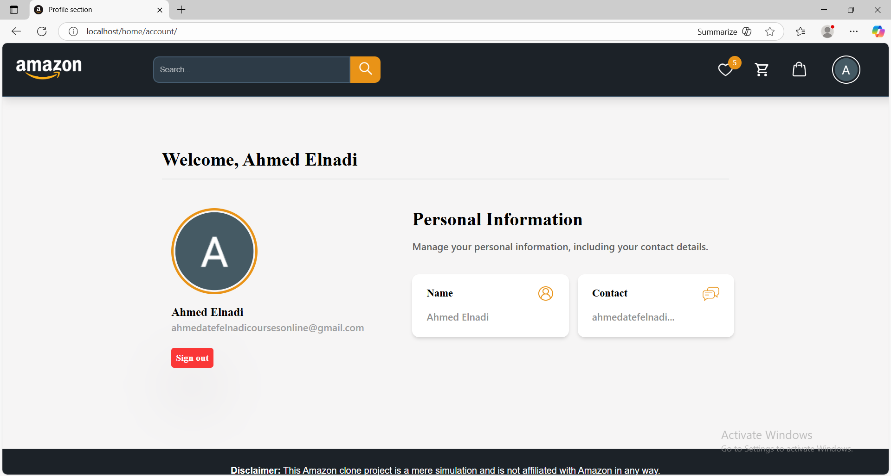
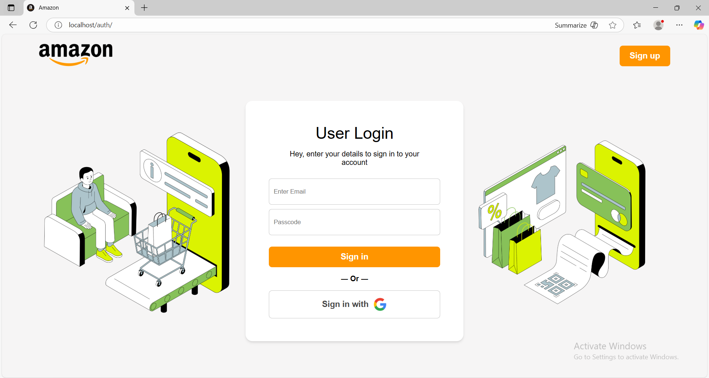

# Amazon-Clone

> A full-stack e-commerce application inspired by Amazon — React frontend with Node.js microservices for backend. Each service is containerized and routed through an Nginx reverse proxy. This repository includes two deployment options: a Docker Compose setup and a Kubernetes (Ingress) setup.

---

## Demo Video

[](https://github.com/user-attachments/assets/f7af99a7-5c1b-4a52-bf2d-ff822bfd3cf0)

---

## Quick Gallery

1. **Home / Catalog:**  
   

2. **Product Page:**  
   

3. **Cart / Checkout:**  
   

4. **Orders / Admin:**  
   

5. **Payment:**  
   

6. **Wishlist:**  
   

7. **Account:**  
   

8. **Auth / Login:**  
   


> Replace the image names above with actual screenshots in `Images/` (example: `Images/home_screenshot.PNG`). If you don't have screenshots yet, remove this section or add them later.

---

## Table of Contents

- [Demo Video](#demo-video)  
- [Quick Gallery](#quick-gallery)  
- [Overview](#overview)  
- [Repo / Deployment folders](#repo--deployment-folders)  
- [Architecture](#architecture)  
- [Feature](#feature)  
- [Prerequisites](#prerequisites)  
- [Installation & Setup](#installation--setup)  
  - [Run with Docker Compose (recommended for local dev)](#run-with-docker-compose-recommended-for-local-dev)  
  - [Run on Kubernetes (Ingress)](#run-on-kubernetes-ingress)  
- [Run services individually (development)](#run-services-individually-development)  
- [Configuration & Environment Variables](#configuration--environment-variables)  
- [Project structure](#project-structure)  
- [Troubleshooting](#troubleshooting)  
- [Contact](#contact)  
- [License](#license)


---

## Overview

This repo contains a containerized e-commerce platform split into Node.js microservices and a React frontend. Nginx is used as a reverse proxy/gateway to route requests to the appropriate service. The repo provides two ways to run the project locally:
  1. Docker Compose — single command local stack for development.
  2. Kubernetes + Ingress — manifests to deploy each service in a k8s cluster and use an ingress (useful for testing production-like routing).

Microservices in this repo (each in its own folder):
- `Auth` — authentication (JWT / login / register)
- `Account` — user profile management
- `Product` — products CRUD & catalog
- `Cart` — cart service
- `Orders` — orders service
- `Payment` — payment gateway connector
- `Wishlist` — wishlist service
- `Home_Page` — frontend app (React)
- `nginx.conf` — routing / proxy config
- `docker-compose.yml` — orchestrates services and networks (Docker Compose option)
- `k8s/ or kubernetes/` — Kubernetes manifests / ingress (K8s option)

---

## Repo / Deployment folders
You mentioned you have two folders in the repository:

   - `amazonclone-docker-compose` — contains docker-compose.yml and compose-based service definitions.
   - `amazon-clone-kubernetes-ingress` — contains Kubernetes manifests and example Ingress rules.

This README below is tailored for the repo:
```plain
https://github.com/AhmedDev374/Amazon-Clone
```

> If the exact folder names in your repo differ slightly, update the commands below to the actual folder names.

---

## Architecture

```plaintext
[ Browser / Client ] --> nginx (reverse proxy)
                               |
       --------------------------------------------------------
       |          |             |           |           |     |
    Frontend   Auth         Product      Orders     Payment  Other
    (React)   (Service)     (Service)    (Service)   (Service)
       |          |             |           |           |
    (Static)  (API JWT)     (API CRUD)   (API)    (3rd-party)
```
All services are built/run as Docker containers and (optionally) deployed to Kubernetes, communicating over an internal network.

---

## Feature
  - Microservice architecture (independent services)
  - React-based frontend (single-page app)
  - Nginx reverse proxy for routing
  - Dockerized for easy local deployment
  - Kubernetes manifests + Ingress for cluster deployment/testing
  - Basic authentication and session flow (JWT)
  - Cart, wishlist, orders, payment microservices
  - Ready to extend with DB, cache and external integrations

---

## Prerequisites

Make sure you have the tools needed for the deployment method you choose.

For Docker Compose
   1. **Docker** – 24.x or later
   2. **Docker Compose** – v2.x (included with recent Docker Desktop)

For Kubernetes
   1. kubectl
   2. A Kubernetes cluster (minikube, kind, microk8s, or a managed cluster)
   3.  An Ingress controller installed (for minikube you can ```minikube addons enable ingress```)

Verify:
```plaintext
docker --version
docker compose version
kubectl version --client
minikube version    # if using minikube
```

---


## Installation & Setup

1. **Clone the repository**:
```plaintext
git clone https://github.com/AhmedDev374/Amazon-Clone.git
cd Amazon-Clone
```

2. Create an ```.env``` file (copy the example below or touch .env and fill it).

## Run with Docker Compose (recommended for local dev)
```plaintext
# from repo root or inside amazonclone-docker-compose (if compose file is inside that folder)
cd amazon-clone-docker-compose-react  # adjust to the actual folder if needed
docker compose up --build
```
Visit the services (example routes — confirm exact ports in ```docker-compose.yml```):
   - Frontend (React / SPA): http://localhost/home
   - Nginx (entry point / reverse proxy): http://localhost
   - APIs:
      - http://localhost/auth
      - http://localhost/home
      - http://localhost/home/orders
      - http://localhost/home/wishlist
      - http://localhost/home/account
      - http://localhost/home/payment
      - http://localhost/home/product/<id>
      - http://localhost/home/cart
      
> **Note:** exact ports/paths depend on the docker-compose.yml mapping. If a service fails to come up, run docker compose logs <service-name>.

---

## Run on Kubernetes (Ingress)
If you prefer to run in Kubernetes (Ingress), use the manifests in the K8s folder.

Example (minikube):
```plaintext
# start minikube
minikube start --driver=docker

# enable ingress (minikube)
minikube addons enable ingress

# Change [ingress-nginx-controller ] form node port to loadBalancer
kubectl get svc -n ingress-nginx
kubectl patch svc ingress-nginx-controller -n ingress-nginx --type=merge -p '{\"spec\":{\"type\":\"LoadBalancer\"}}'

# PowerShell Admins
C:\Windows\System32\drivers\etc\hosts
<EXTERNAL-IP of  ingress-nginx-controller >  <host>
Ex:
   127.0.0.1 localhost

# Make Tunnel
minikube tunnel

# apply k8s manifests (adjust path to your k8s folder)
cd amazon-clone_kubernetes_ingress
kubectl apply -f <name of file>.yml

# Apply Ingress
cd Ingress
kubectl apply -f ingress.yml
```

Check resources:

```plaintext
kubectl get pods -n amazon-clone
kubectl get svc -n amazon-clone
kubectl get ingress -n amazon-clone
```

---

## Run services individually (development)
To run a single service without Docker (useful for debugging):
```plaintext
cd amazon-clone-docker-compose-react
# example: Product
cd Product
npm install
npm start
```
Repeat for ```Auth```, ```Cart```, ```Orders```, etc. The frontend can be run with ```npm start``` inside ```Home_Page``` (React dev server).

```plaintext
cd Home_Page
npm install
npm start
```
When running locally, update the frontend API base URLs to point to the ports for the backend services you started.

---

## Configuration & Environment Variables
Create a root ```.env``` or per-service ```.env``` files. Example (fill with your real values):
```plaintext
# Example global env
NGINX_HOST=localhost

# Example for Auth / services
JWT_SECRET=your_jwt_secret
MONGO_URI=mongodb://host:27017/amazon_clone
REDIS_URL=redis://redis:6379

# Payment
PAYMENT_PROVIDER_KEY=sk_test_xxx

# Frontend
REACT_APP_API_BASE=http://localhost:8000
```
Each microservice may expect additional env vars (DB credentials, third-party keys). Check each service folder for ```.env.example``` or config files. If not present, create them as needed.

---

## Project structure
```plaintext
Amazon-Clone/
├── Account/
├── Auth/
├── Cart/
├── Home_Page/         # React frontend
├── Orders/
├── Payment/
├── Product/
├── Wishlist/
├── docker-compose.yml
├── nginx.conf
└── README.md
```

---

## Troubleshooting
Containers won't start / port conflicts
   - Inspect compose logs:
```plaintext
   docker compose logs --tail=200
   docker compose logs <service-name>
```
   - Free used ports or edit docker-compose.yml to map different host ports.

Kubernetes pods fail
- Check pod logs:
```plaintext
kubectl logs <pod-name> -n amazon-clone
kubectl describe pod <pod-name> -n amazon-clone
```

Service cannot connect to DB
   - Confirm ```MONGO_URI``` (or DB host) is reachable from containers.
   - If running DB locally (not in compose), use host networking or proper hostnames.

Frontend shows CORS errors
   - Ensure the backend services allow the frontend origin or run everything behind Nginx (so same origin).

Missing env vars or keys
   - Check each service folder for README or .env.example. Add required envs to .env files.

---

## Contact

For questions or feedback, reach out to Ahmed at

1. **LinkDin**: https://eg.linkedin.com/in/ahmed-atef-elnadi-8165a51b9

---

## License

This project is licensed under the **GNU General Public License v3.0**.  
See the full license text here: [LICENSE](LICENSE).
