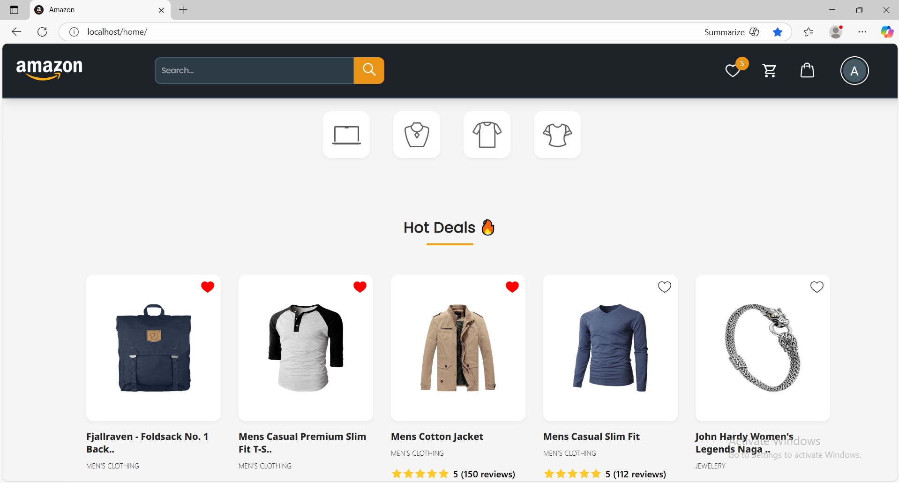
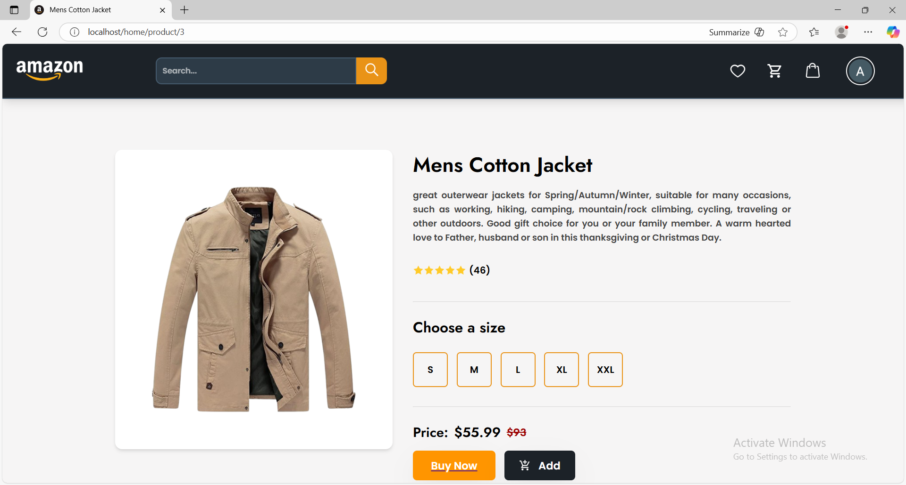
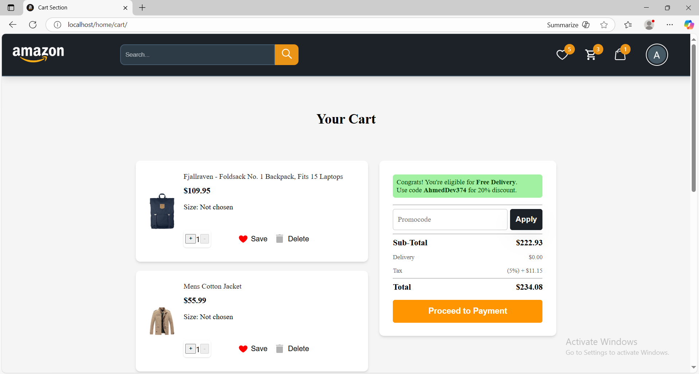
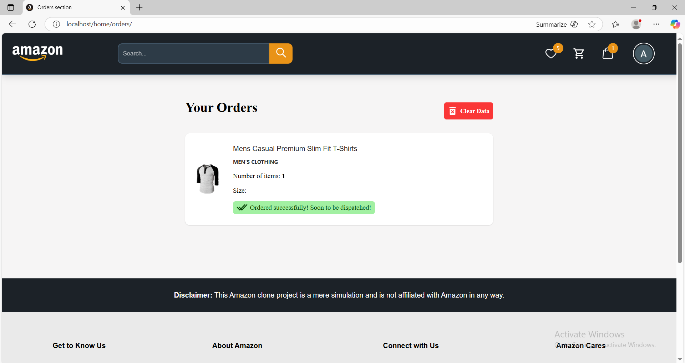
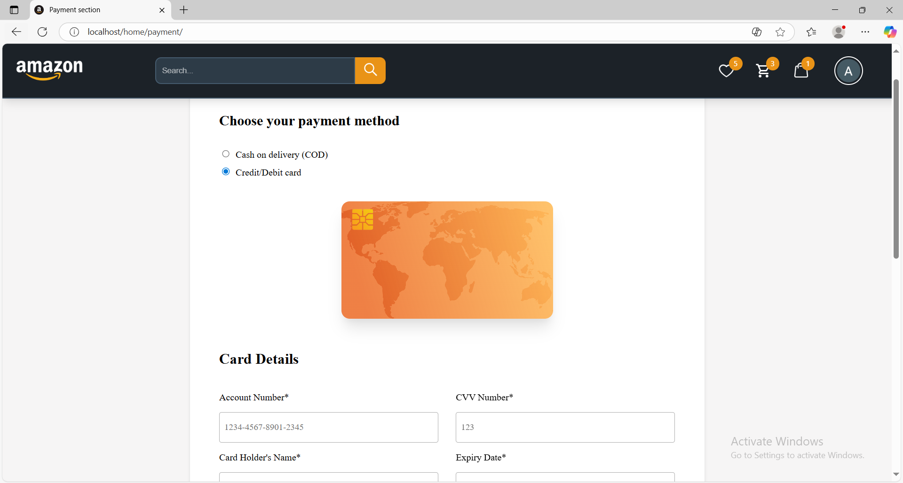
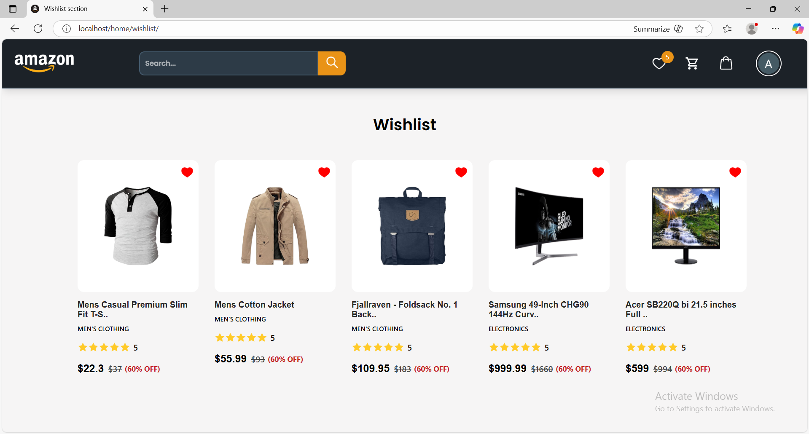
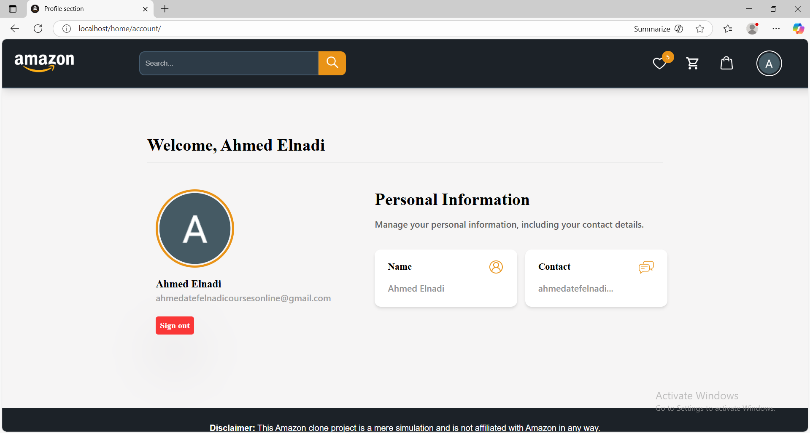

# Amazon-Clone

> A full-stack e-commerce application inspired by Amazon — React frontend with Node.js microservices for backend. Each service is containerized and routed through an Nginx reverse proxy.

---
## Demo Video

https://github.com/user-attachments/assets/f7af99a7-5c1b-4a52-bf2d-ff822bfd3cf0
---

## Quick gallery

## Quick Gallery

1. **Home / Catalog:**  
   

2. **Product Page:**  
   

3. **Cart / Checkout:**  
   

4. **Orders / Admin:**  
   

5. **Payment:**  
   

6. **Wishlist:**  
   

7. **Account:**  
   

8. **Auth / Login:**  
   


> Replace the image names above with actual screenshots in `Images/` (example: `Images/home_screenshot.PNG`). If you don't have screenshots yet, remove this section or add them later.

---

## Table of Contents

- [Overview](#overview)  
- [Architecture](#architecture)  
- [Features](#features)  
- [Prerequisites](#prerequisites)  
- [Install & Run (Docker Compose)](#install--run-docker-compose)  
- [Run services individually (dev)](#run-services-individually-dev)  
- [Configuration / .env examples](#configuration--env)  
- [Project structure](#project-structure)  
- [Troubleshooting](#troubleshooting)  
- [Contact](#contact)  
- [License](#license)

---

## Overview

This repo contains a containerized e-commerce platform split into multiple Node.js microservices and a React frontend. Nginx is used as a reverse proxy/gateway to route requests to the appropriate service. `docker-compose.yml` orchestrates everything for local development.

Microservices in this repo (each in its own folder):
- `Auth` — authentication (JWT / login / register)
- `Account` — user profile management
- `Product` — products CRUD & catalog
- `Cart` — cart service
- `Orders` — orders service
- `Payment` — payment gateway connector
- `Wishlist` — wishlist service
- `Home_Page` — frontend app (React)
- `nginx.conf` — routing / proxy config
- `docker-compose.yml` — orchestrates services and networks

---

## Architecture

```plaintext
[ Browser / Client ] --> nginx (reverse proxy)
                               |
       --------------------------------------------------------
       |          |             |           |           |     |
    Frontend   Auth         Product      Orders     Payment  Other
    (React)   (Service)     (Service)    (Service)   (Service)
       |          |             |           |           |
    (Static)  (API JWT)     (API CRUD)   (API)    (3rd-party)
```
All services are built/run as Docker containers and communicate over an internal Docker network.

---

## Feature
  - Microservice architecture (independent services)
  - React-based frontend (single-page app)
  - Nginx reverse proxy for routing
  - Dockerized for easy local deployment
  - Basic authentication and session flow (JWT)
  - Cart, wishlist, orders, payment microservices
  - Ready to extend with DB, cache and external integrations

---

## Prerequisites

Ensure the following are installed on your system:

1. **Docker** – 24.x or later
2. **Docker Compose** – v2.x (included with recent Docker Desktop)

Verify:

```plaintext
docker --version
docker compose version
```

---


## Installation & Setup

1. **Clone the repository**:
```plaintext
git clone https://github.com/AhmedDev374/Site-Observability-Platform.git
cd Site-Observability-Platform
```

2. Create an ```.env``` file (copy the example below or touch .env and fill it).

3. **Build and start the stack:**:
```plaintext
docker compose up --build
```
4. Visit the services (example ports — check ```docker-compose.yml``` for exact mappings):
   - Frontend (React): ```http://localhost/home```
   - Nginx (reverse proxy / entry): ```http://localhost```
   - Individual microservice APIs (example):
```plaintext
   -    http://localhost/auth
   -    http://localhost/home
   -    http://localhost/home/orders
   -    http://localhost/home/wishlist
   -    http://localhost/home/account
   -    http://localhost/home/payment
   -    http://localhost/home/product/<id>
   -    http://localhost/home/cart
```
> **Note:** Exact ports and hostnames depend on the docker-compose.yml in this repo. If a service fails to come up, check the compose file and service logs.

---

## Run services individually (development)
If you want to run a single service locally (without Docker):
```plaintext
# example for Product service
cd Product
npm install
then
npm start
```
Repeat for ```Auth```, ```Cart```, ```Orders```, etc. The frontend can be run with ```npm start``` inside ```Home_Page``` (React dev server).

When running locally you might need to update the frontend API base URLs to point to the service ports you started.

---

## Configuration & Environment Variables
Create a root ```.env``` or per-service ```.env``` files. Example (fill with your real values):
```plaintext
# Example global env
NGINX_HOST=localhost

# Example for Auth / services
JWT_SECRET=your_jwt_secret
MONGO_URI=mongodb://host:27017/amazon_clone
REDIS_URL=redis://redis:6379

# Payment
PAYMENT_PROVIDER_KEY=sk_test_xxx

# Frontend
REACT_APP_API_BASE=http://localhost:8000
```
Each microservice may expect additional env vars (DB credentials, third-party keys). Check each service folder for ```.env.example``` or config files. If not present, create them as needed.

---

## Project structure
```plaintext
Amazon-Clone/
├── Account/
├── Auth/
├── Cart/
├── Home_Page/         # React frontend
├── Orders/
├── Payment/
├── Product/
├── Wishlist/
├── docker-compose.yml
├── nginx.conf
└── README.md
```

---

## Troubleshooting
Containers won't start / port conflicts
   - Inspect compose logs:
```plaintext
   docker compose logs --tail=200
   docker compose logs <service-name>
```
   - Free used ports or edit docker-compose.yml to map different host ports.

Service cannot connect to DB
   - Confirm ```MONGO_URI``` (or DB host) is reachable from containers.
   - If running DB locally (not in compose), use host networking or proper hostnames.

Frontend shows CORS errors
   - Ensure the backend services allow the frontend origin or run everything behind Nginx (so same origin).

Missing env vars or keys
   - Check each service folder for README or .env.example. Add required envs to .env files.

---

## Contact

For questions or feedback, reach out to Ahmed at

1. **LinkDin**: https://eg.linkedin.com/in/ahmed-atef-elnadi-8165a51b9

